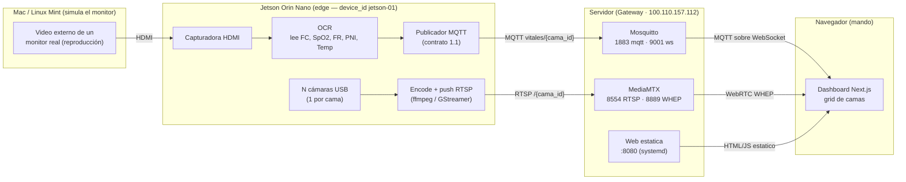
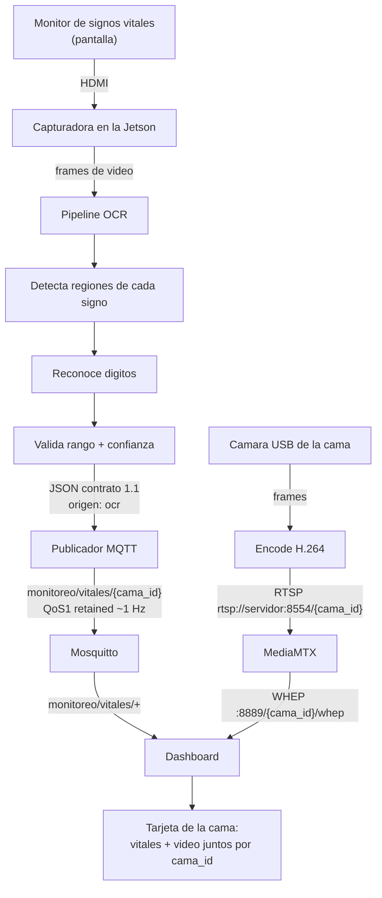
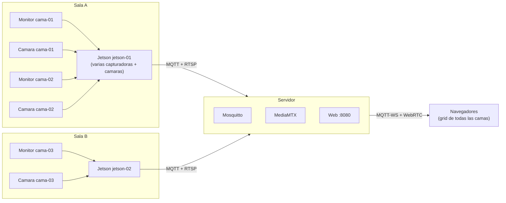

# ARCHITECTURE — Monitoreo Pediatría

> Documento vivo de arquitectura. Describe la topología, los componentes y el flujo de
> datos del sistema **en su paradigma actual** (captura por video + OCR en Jetson).
> Para el *porqué* de cada decisión ver [`DECISIONS.md`](DECISIONS.md); para reglas de
> negocio, límites y estado WIP ver [`CONTEXT.md`](CONTEXT.md).

**Última actualización:** 2026-07-22 · **Contrato de datos:** `1.1`

---

## 1. Qué es el sistema

Plataforma de monitoreo pediátrico/neonatal **multi-cama**. Muestra en un tablero web, en
tiempo real y por cada cama, sus **signos vitales** y su **video en vivo**, servido desde un
servidor propio sobre red privada Tailscale.

> Es una herramienta **secundaria de observación**. NO sustituye al monitor de signos
> vitales certificado ni al juicio clínico. (Ver `CONTEXT.md` §Reglas de negocio.)

---

## 2. Cambio de paradigma (julio 2026)

El sistema cambió **cómo obtiene el dato del signo vital**, no el resto del stack.

| | Antes (Hitos 1–2) | Ahora (paradigma Jetson + OCR) |
|---|---|---|
| Fuente del dato | Simulador Python que emite JSON, o monitor real por HL7/PDS digital | **Imagen del monitor leída por OCR** |
| Edge | Laptop/Raspberry con webcam | **Jetson Orin Nano** (OCR + captura de cámaras) |
| Entrada de vitales | Directa (digital) | **Capturadora HDMI** que digitaliza la pantalla del monitor → OCR |
| Servidor / transporte / web | Mosquitto + MediaMTX + Next.js | **Sin cambios** |

Clave del diseño: el OCR **produce el mismo contrato de datos** que producía el simulador
(solo cambia `origen`), así que **el servidor y la web no se modifican**. La fuente del dato
es intercambiable por contrato. (Ver [`DECISIONS.md`](DECISIONS.md) ADR-001.)

---

## 3. Unidades y nombres

El pegamento de todo el sistema es el **`cama_id`**.

| Concepto | Identificador | Regla |
|---|---|---|
| **Cama** | `cama_id` (`cama-01`, `cama-02`…) | Unidad lógica. **1 cama = 1 monitor + 1 cámara.** Es a la vez el topic de datos y el nombre del stream de video. |
| **Jetson (edge)** | `device_id` (`jetson-01`…) | 1 Jetson cubre **N camas**. Puede haber **varias Jetsons**. |
| **Monitor** | (implícito en la cama) | Su pantalla entra por una capturadora HDMI de la Jetson → OCR → vitales de esa cama. |
| **Cámara** | (implícito en la cama) | 1 cámara por cama. La Jetson la encodea y la empuja por RTSP como el stream `cama_id`. |

---

## 4. Topología — banco de pruebas (POC actual)

Setup físico con el que se está desarrollando hoy:



En el POC, la Mac reproduce **un** video de monitor (una cama con vitales por OCR) y la Jetson
captura además las cámaras. En producción, cada cama tiene su propio monitor físico.

---

## 5. Flujo de datos — una cama (detalle)



La web une video + datos porque **ambos usan el mismo `cama_id`**: datos en
`monitoreo/vitales/cama-01`, video en el stream `/cama-01`.

---

## 6. Topología — producción multi-cama / multi-Jetson



Escala por adición: sumar una cama = una capturadora + una cámara en alguna Jetson; sumar
capacidad = otra Jetson. El servidor y la web no cambian: descubren camas por los topics MQTT.

---

## 7. Componentes y puertos

| Componente | Máquina | Rol | Puertos |
|---|---|---|---|
| **Video externo de monitor** | Mac / Linux Mint | Simula la pantalla del monitor (POC) | salida HDMI |
| **Capturadora HDMI** | Jetson | Digitaliza la pantalla del monitor | USB / dispositivo V4L2 |
| **OCR + publicador** | Jetson | Lee los números → JSON contrato → MQTT | — |
| **Cámaras + encode** | Jetson | Video en vivo por cama → RTSP | USB / V4L2 |
| **Mosquitto** | Servidor `100.110.157.112` | Broker MQTT de vitales | `1883` mqtt, `9001` websockets |
| **MediaMTX** | Servidor | Ingesta RTSP → sirve WebRTC | `8554` RTSP in, `8889` WHEP out |
| **Web estática** | Servidor | Sirve el dashboard (systemd `dashboard`) | `8080` |
| **Dashboard** | Navegador (mando) | Next.js export estático, grid de camas | — |

Toda la comunicación entre máquinas va cifrada sobre **Tailscale**.

---

## 8. Contrato de datos (resumen)

Transporte **MQTT**; la web se construye contra el contrato, la fuente es intercambiable.

| Topic | Publica | Contenido | QoS / retención |
|---|---|---|---|
| `monitoreo/vitales/{cama_id}` | Jetson (OCR) | JSON de signos ~1 Hz | QoS 1, retained |
| `monitoreo/estado/{cama_id}` | Jetson | online/offline del edge | QoS 1, retained |

```json
{
  "contrato": "1.1",
  "cama_id": "cama-01",
  "device_id": "jetson-01",
  "ts": "2026-07-22T20:15:03Z",
  "origen": "ocr",
  "signos": {
    "fc":   { "valor": 142,  "unidad": "lpm", "confianza": 0.98 },
    "spo2": { "valor": 97,   "unidad": "%",   "confianza": 0.95 },
    "fp":   { "valor": 141,  "unidad": "lpm", "confianza": 0.9 },
    "fr":   { "valor": 48,   "unidad": "rpm", "confianza": 0.88 },
    "temp": { "valor": 36.9, "unidad": "C",   "confianza": 0.97 },
    "pni":  { "sis": 66, "dia": 39, "media": 48, "unidad": "mmHg", "ts": "2026-07-22T20:10:00Z", "confianza": 0.8 }
  }
}
```

Cambios `1.0 → 1.1` (compatibles hacia atrás): `origen` puede valer `"ocr"`; cada signo puede
llevar `confianza` (0–1) opcional. La web actual **ignora** `confianza`, así que no se rompe.
Especificación completa: [`docs/ito2/CONTRATO_DATOS.md`](docs/ito2/CONTRATO_DATOS.md).

Correspondencia con el video: el `cama_id` **es** el nombre del stream —
`rtsp://<servidor>:8554/{cama_id}` (in) y `http://<servidor>:8889/{cama_id}/whep` (out).

---

## 9. Estructura del repositorio

```
capture/        Captura camara Femto Bolt (Hito 1 / profundidad a futuro)
simulador/      Simulador legacy: emite el contrato por MQTT + video webcam.
                Ahora sirve para probar la web SIN Jetson.
ocr/            Lectura de signos por OCR + publicacion MQTT (offline sobre imagen fija)
  lector.py       Orquestador: imagen + perfil de ROIs -> mensaje contrato 1.1
  cli.py          CLI: lee una imagen y emite el JSON (python -m ocr.cli)
  publicar.py     Puente OCR -> MQTT en bucle (python -m ocr.publicar)
  publicador.py   PublicadorOCR: transporta el contrato por MQTT (cliente inyectado)
  fuente.py       FuenteFrames + FuenteImagenFija + FuenteCapturadora (V4L2 en vivo)
  tiempo.py       ahora_iso(): ts del contrato, compartido lector/publicador
  contrato.py     Construccion del JSON 1.1 (unidades fijas, PNI todo-o-nada)
  perfiles.py     Carga/validacion de perfiles (ROI, signo ausente, campo combinado)
  preproceso.py   Recorte ROI, gris, umbral Otsu, normalizacion
  digitos.py      Render de digitos 7 segmentos y '/' (compartido mock <-> motor)
  motor/          Motores OCR intercambiables (base.py = interfaz LectorOCR;
                  paddle.py = PRODUCCION (PaddleOCR, dep. opcional, ADR-016);
                  plantilla.py = andamiaje, no apto para produccion, ver ADR-014)
  herramientas/   calibrar.py (ROIs) y evaluar_motores.py (comparativa ADR-016)
  perfiles/       Perfiles de monitor: monitor_mock.json y simcore/ (frame real)
  mock/           Generadores de imagen mock (completo y con PNI combinada)
  tests/          pytest: mock, campos combinados, frame real, contrato, perfiles
web/nextapp/    Dashboard Next.js (export estatico). Consume MQTT-WS + WebRTC.
docs/ito1/      Doc e imagenes Hito 1 (video end-to-end)
docs/ito2/      Doc, contrato de datos, runbook y diagramas Hito 2
ARCHITECTURE.md DECISIONS.md CONTEXT.md   Documentacion Minima Viable (MVD)
```

> `ocr/` cubre la cadena completa del edge: **captura en vivo** de la capturadora HDMI→USB
> por V4L2 (`FuenteCapturadora`) → lectura OCR (**PaddleOCR**, ADR-016; el de plantilla es
> andamiaje sin dependencias) → **publicación MQTT** del contrato (vitales + estado), con lo
> que la cama aparece en el dashboard end-to-end. El perfil de SimCore está calibrado contra
> el frame real de la capturadora. Pendiente: instalar el motor en la Jetson (runbook en
> `ocr/README.md`; en aarch64 puede requerir la vía ONNX de ADR-016) y multi-cama. El resto
> del stack (servidor, transporte, web) ya está probado desde el Hito 2.

---

## 10. Qué es histórico vs. vigente

- **Vigente:** servidor (Mosquitto + MediaMTX + web Next.js), transporte MQTT + RTSP/WebRTC,
  contrato de datos, red Tailscale, `cama_id` como unidad.
- **Reemplazado como fuente de dato en producción:** el simulador digital y el adaptador
  HL7/PDS pasan a segundo plano; la fuente ahora es capturadora + OCR. El simulador
  **se conserva** como banco de pruebas de la web.
- **Futuro (no implementado):** respiración por cámara de profundidad + IA, persistencia
  "caja negra", lógica de alarmas por anomalías. Ver `CONTEXT.md` §Estado / WIP.
