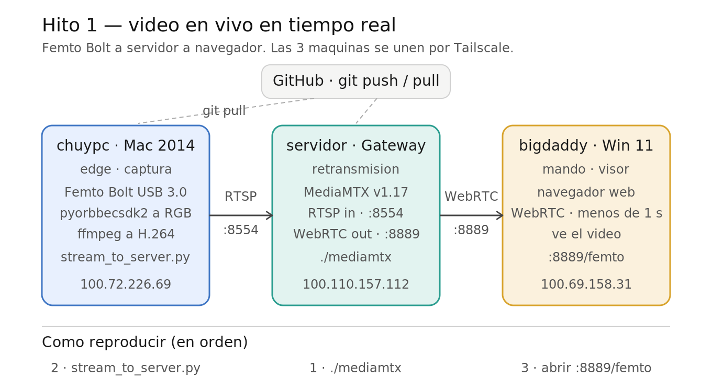

# Hito 1 — Video en vivo en tiempo real ✅



Primer resultado funcional: el video de la Femto Bolt se ve en vivo en el navegador, viajando entre tres máquinas unidas por Tailscale.

```
[chuypc · Mac]  --RTSP :8554-->  [servidor · Gateway]  --WebRTC :8889-->  [bigdaddy · Windows]
  Femto + captura                  MediaMTX retransmite                     navegador / visor
        ^                                  ^
        └────────── git pull ── GitHub ── git pull ──────────┘
```

## Las tres partes

### 1. chuypc — MacBook Pro 2014 (edge / captura)
- SO: Linux Mint 22.3 · Python 3.12 · Tailscale `100.72.226.69`
- Cámara: Orbbec Femto Bolt por **USB 3.0** (negocia 5000 Mbps; con cable/puerto USB 2.0 falla)
- Lee la cámara con `pyorbbecsdk2` (RGB 1920x1080 + profundidad 640x576)
- Codifica el RGB a H.264 con `ffmpeg` y lo publica por RTSP
- Código: `capture/stream_to_server.py` (+ `capture/utils.py`)

### 2. servidor — laptop Gateway (servidor / retransmisión)
- SO: Ubuntu · Celeron N4020 · Tailscale `100.110.157.112`
- `MediaMTX v1.17.0`: recibe RTSP en `:8554` y sirve WebRTC en `:8889`
- No recodifica el video, solo lo reparte (por eso aguanta el CPU modesto)

### 3. bigdaddy — PC Windows 11 (mando / visor)
- Tailscale `100.69.158.31`
- Abre el navegador en `http://100.110.157.112:8889/femto`
- Ve el video en vivo con menos de ~1 segundo de retraso

## Cómo reproducirlo

**Requisito una sola vez:** Femto instalada en la Mac (ver `docs/INSTALACION_LAPTOP.md`) y MediaMTX descargado en el servidor (ver `docs/STREAMING.md`).

1. **Servidor** — arrancar MediaMTX:
   ```bash
   cd ~/mediamtx && ./mediamtx
   ```
2. **Mac** — con la Femto conectada al puerto USB 3.0:
   ```bash
   cd ~/MonitoreoPediatria/capture
   source ~/orbbec_env/bin/activate
   python stream_to_server.py
   ```
3. **Windows** — abrir en el navegador:
   ```
   http://100.110.157.112:8889/femto
   ```

## Distribución del código
GitHub `github.com/chuyAguilar/MonitoreoPediatria` es el central. Flujo: editar en Windows → `git push` → `git pull` en la Mac y el servidor.

## Estado de fases
- **Hito 1 — video en vivo: COMPLETO** ✅
- Hito 2 (siguiente): video en vivo + visión por computadora (OpenCV / MediaPipe) para procesar la imagen del infante.
- Pendiente fase 1: extracción de signos vitales del monitor Mindray uMEC10/uMEC12 (HL7/PDS) + simulador mientras llega el monitor real.
