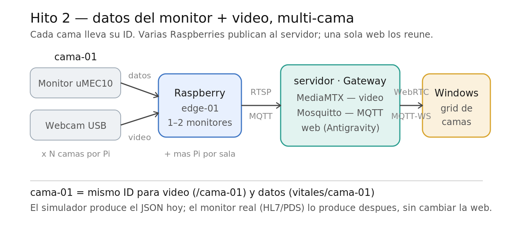
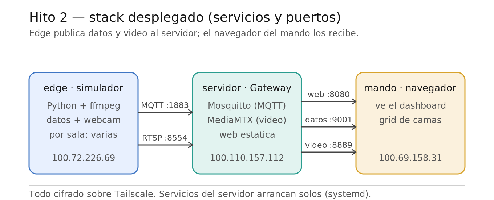

# Hito 2 — Datos del monitor + video, multi-cama ✅



Segundo resultado funcional: un tablero web muestra, en tiempo real, varias camas a la vez, cada una con sus **signos vitales** y su **video en vivo**, todo servido desde el servidor propio. El monitor real aún no llega, así que sus datos se **simulan** con un formato intercambiable.

> Herramienta secundaria de observación. NO sustituye al monitor de signos vitales ni al juicio clínico.

## Qué se logró

- **Contrato de datos** versionado (`CONTRATO_DATOS.md`): formato JSON de los signos vitales, con `cama_id` para multi-cama. La fuente es intercambiable (simulador hoy, monitor real después).
- **Simulador de monitores** (`simulador/`): genera signos vitales neonatales realistas para N camas, los publica por MQTT, y transmite el video de webcams reales por RTSP. Permite elegir a qué cama va cada cámara.
- **Broker MQTT** (Mosquitto) en el servidor: recibe los datos de los edges y los reparte a la web por WebSocket.
- **Web Next.js** (`web/nextapp/`): dashboard que descubre las camas dinámicamente, muestra signos vitales y video WebRTC, con reconexión automática. Compilada estática y auto-alojada en el servidor.
- **Despliegue** como servicios que arrancan solos (Mosquitto, MediaMTX, web).

## Arquitectura (resumen)
```
[Monitor simulado + webcam] --datos MQTT / video RTSP--> [Servidor: Mosquitto + MediaMTX + web]
                                                                        |
                                                          --MQTT-WS + WebRTC-->
                                                                        v
                                                            [Navegador: grid de camas]
```
Detalle completo y comandos en `REPRODUCIR_DESDE_CERO.md`.



## Componentes y puertos (servidor)
| Servicio | Puerto | Función |
|----------|--------|---------|
| Mosquitto | 1883 / 9001 | Datos MQTT (edge) / MQTT-WebSocket (web) |
| MediaMTX | 8554 / 8889 | Entra video RTSP / sale video WebRTC |
| Web estática | 8080 | Sirve el dashboard |

## Stack tecnológico
- Edge: Python (paho-mqtt, OpenCV, ffmpeg).
- Servidor: Mosquitto 2.0, MediaMTX 1.17, servidor estático.
- Web: Next.js 15 (App Router, TypeScript, export estático), MQTT.js, WebRTC WHEP.
- Red: Tailscale.

## Limitaciones conocidas
- El video con **webcams genéricas** se ve con lag/entrecortado (la cámara no sostiene captura limpia); con hardware de mejor calidad o el video del monitor real mejora. Se mitigó usando captura MJPEG y bajando resolución/fps.
- `allow_anonymous` en MQTT y sin TLS: válido para desarrollo en la tailnet; producción requiere autenticación.
- Sin persistencia de datos todavía (la "caja negra" / histórico es trabajo futuro).

## Lecciones técnicas
- WHEP 404 = no hay video publicado en ese instante (no es CORS); la web debe reintentar.
- Webcams: capturar en crudo (YUYV) a 640x480/30 satura el USB y corrompe cuadros; usar `-input_format mjpeg`.
- Auto-alojar la web evita el bloqueo de contenido mixto (HTTPS→ws/http) que tendría Vercel.

## Siguientes pasos posibles
- Integrar el monitor real (adaptador HL7/PDS → mismo contrato).
- Persistencia / caja negra y alertas de anomalías.
- Fase de IA: respiración por profundidad con la Femto Bolt (investigación en `INVESTIGACION_OPENSOURCE.md`).
